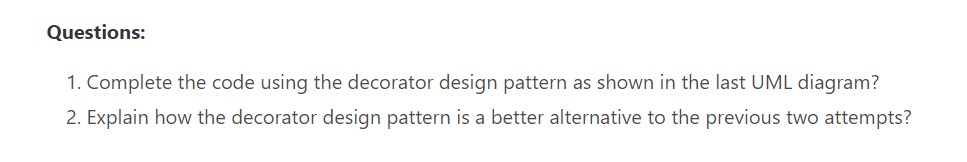

# CPIT252-Lab6-submission
This is the submission file for lab 6 activity for CPIT252

A1: the first solution is simply not great and suffers class explosion and is very hard to maintain and deal with, the second soultion was somehow good but could not make sense in some cases, and suffers from unnecesary parts of the code present in unnescesary places.

The third solution which is the decorator design pattern solution is the best and  by using composition it provides loose coupling between classes and is much easier to maintain and change in the future.
